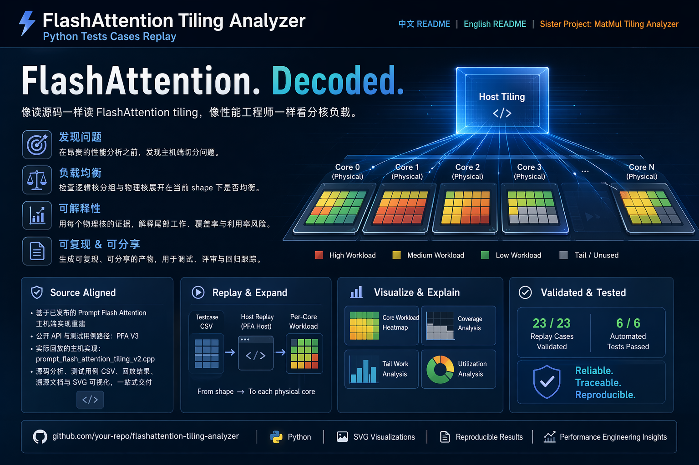

# FlashAttention Tiling Analyzer


[中文 README](README.zh-CN.md) | [English README](README.md) | [Sister Project: MatMul Tiling Analyzer](https://github.com/YuXiang-ZhuanSun/ascend_matmul_tiling_analyzer)



FlashAttention. Decoded.

This repository reconstructs Prompt Flash Attention tiling from the shipped source tree and then pushes past host-side split boundaries into kernel-side execution context.

## What This Tool Covers

- host-side tiling structs, constants, setter mappings, and split logic
- kernel entry functions, dispatch branches, tiling-key candidates, and vector/cube lane contracts
- logical-core grouping, physical-core expansion, and per-core workload summaries
- per-core `Q x KV block` SVG visualization

## Why It Is Useful

Most FlashAttention tuning time is lost to uncertainty:

- which host tiling path did a testcase actually hit
- whether logical split groups are balanced
- what each physical core really received
- which kernel-side dispatch family is likely consuming that tiling payload

This project turns those questions into source-backed artifacts.

## What Makes It Credible

- The replay comes from the shipped Prompt Flash Attention host implementation, not handwritten tiling tables.
- The fixture snapshot is now a complete operator snapshot, not a trimmed `op_host` subset.
- The shipped fixture now reports a `manifest_sha256` and verifies file-level sync against the workspace source tree.
- `analyze-source` inspects both `op_host` and `op_kernel`.
- `replay-cases` emits both workload detail and kernel execution context.
- The current sample validates `23 / 23` replay rows and `12 / 12` automated tests.

## Outputs

For source analysis:

- `docs/fpa_source_analysis.json`
- fixture completeness check and source origin
- fixture manifest hash and workspace sync status
- host struct / setter / function traceability
- kernel entrypoints, dispatch branches, and tiling-key template traceability

For testcase replay:

- `examples/fa_tiling_output.json`
- `examples/fa_tiling_summary.csv`
- `examples/visualizations/*.svg`
- `kernel_execution_model`
- per-core `kernel_execution`

## Quick Start

```bash
python -m pip install -e .
python cli.py --input=testcases/fa_testcases.csv --output-dir=results/quickstart
python -m unittest discover -s tests -v
```

This writes:

- `results/quickstart/replay.json`
- `results/quickstart/summary.csv`
- `results/quickstart/visualizations/*.svg`

Advanced commands are still available when you want explicit artifact paths or source-only analysis:

```bash
python tiling_tool.py analyze-source --output docs/fpa_source_analysis.json
python tiling_tool.py replay-cases --source-root fixtures/prompt_flash_attention --input testcases/fa_testcases.csv --output examples/fa_tiling_output.json --summary-csv examples/fa_tiling_summary.csv --visualize-dir examples/visualizations
```

## Project Layout

- `cli.py`: simple replay entry for `--input` + `--output-dir`
- `fixtures/prompt_flash_attention/`: complete operator snapshot used for standalone delivery
- `testcases/`: shipped testcase copy
- `tiling_tool.py`: compatibility wrapper for advanced subcommands
- `src/flashattention_cli.py`: CLI entry
- `src/flashattention_models.py`: shared data models
- `src/flashattention_utils.py`: helpers
- `src/flashattention_analyzers/`: host and kernel source analyzers plus replay logic
- `tests/`: automated verification

## Scope

- Current adapter: `PromptFlashAttentionTilingV2`
- Current testcase / API path: `aclnnPromptFlashAttentionV3`
- Current validated split focus: `SPLIT_NBS_CUBE`
- Positioning: analysis and diagnosis tool, not runtime replacement

## Documentation

- [Chinese README](README.zh-CN.md)
- [Architecture](docs/architecture.md)
- [FPA Traceability](docs/fpa_traceability.md)
- [Test Report](docs/test_report.md)
- [Skill Build Report](docs/skill_build_report.md)
- [Fixture Source Note](fixtures/prompt_flash_attention/FIXTURE_SOURCE.md)
