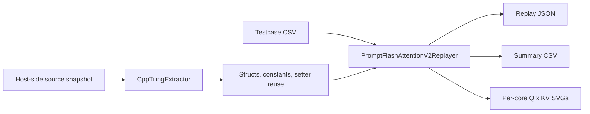

<p align="center">
  
</p>

<h1 align="center">Source-Driven Tiling Tool</h1>

<p align="center">
  Reconstruct operator tiling from real host-side source code, replay it per core, and make every block auditable.
</p>

<p align="center">
  <a href="README.md"><strong>English</strong></a> |
  <a href="README.zh-CN.md"><strong>简体中文</strong></a>
</p>

<p align="center">
  
</p>

## Project Snapshot

| What | Current shipped sample |
| --- | --- |
| First-class adapter | `PromptFlashAttentionTilingV2` |
| API and testcase path | `PFA V3` |
| Host-side tiling implementation actually hit | `prompt_flash_attention_tiling_v2.cpp` |
| Default sample inputs | local fixture snapshot + local testcase copy |
| Output formats | JSON, CSV, SVG |
| Validation | `23 / 23` replay cases passed, `6 / 6` unit tests passed |

`Quickstart` | `Architecture` | `Included Inputs` | `Outputs` | `Validation` | `Roadmap`

> Naming reality:
> the shipped testcase and public API are `PFA V3`, but the provided host-side tiling implementation file is `prompt_flash_attention_tiling_v2.cpp`.
> The current adapter intentionally reproduces the `V2` tiling implementation that the `V3` testcase path actually hits.

## Why This Exists

Operator tiling bugs are expensive because they hide in the gap between three different stories:

- what the API name suggests
- what the testcase exercises
- what the host-side tiling implementation really writes into runtime structures

This project closes that gap.

Instead of hand-written tables or one-off scripts, it gives you a disciplined path from source code to replayable tiling results, with enough structure to extend the same approach to matmul, together, and other operators.

## What Ships In The Box

`source_driven_tiling_tool` is a standalone Python project for tiling analysis and replay. It ships with:

- a local testcase copy
- a local source snapshot sufficient to reproduce the current FPA sample
- an extensible analyzer architecture for future operators
- traceability and validation artifacts, not just code

The current first-class adapter targets the Prompt Flash Attention family.

## Quickstart

Run from the project root:

```bash
python tiling_tool.py analyze-source --output docs/fpa_source_analysis.json
python tiling_tool.py replay-cases --output examples/fa_tiling_output.json --summary-csv examples/fa_tiling_summary.csv --visualize-dir examples/visualizations
python -m unittest discover -s tests -v
```

The replay command also supports explicit inputs:

```bash
python tiling_tool.py replay-cases --source-root fixtures/prompt_flash_attention --cases testcases/fa_testcases.csv --output examples/fa_tiling_output.json --summary-csv examples/fa_tiling_summary.csv --visualize-dir examples/visualizations
```

If you omit the subcommand and provide replay arguments directly, the CLI defaults to `replay-cases`.

## Result Gallery

<p align="center">
  
</p>

The shipped sample produces:

- a source analysis report
- replay JSON with logical-core and physical-core detail
- a testcase summary CSV
- per-core `Q x KV block` SVG visualizations

## Architecture



More detail: [docs/architecture.md](docs/architecture.md)

## Included Inputs

This project carries its own runnable sample inputs:

- testcase copy: [testcases/fa_testcases.csv](testcases/fa_testcases.csv)
- source snapshot:
  - [fixtures/prompt_flash_attention/op_host/prompt_flash_attention_tiling.h](fixtures/prompt_flash_attention/op_host/prompt_flash_attention_tiling.h)
  - [fixtures/prompt_flash_attention/op_host/prompt_flash_attention_tiling_v2.cpp](fixtures/prompt_flash_attention/op_host/prompt_flash_attention_tiling_v2.cpp)
  - [fixtures/prompt_flash_attention/op_host/prompt_flash_attention_tiling_const.h](fixtures/prompt_flash_attention/op_host/prompt_flash_attention_tiling_const.h)
  - [fixtures/prompt_flash_attention/op_api/aclnn_prompt_flash_attention_v3.cpp](fixtures/prompt_flash_attention/op_api/aclnn_prompt_flash_attention_v3.cpp)

The fixture snapshot is intentionally minimal. It contains the files needed to explain and replay the current FPA sample path, not a full mirrored upstream repository.

## Outputs

Primary replay output:

- [examples/fa_tiling_output.json](examples/fa_tiling_output.json)
- [examples/fa_tiling_summary.csv](examples/fa_tiling_summary.csv)
- [examples/visualizations](examples/visualizations)

What you get per case:

- `logical_core_assignments`: source-level logical split groups
- `core_assignments`: expanded physical core view
- `task_units`: finest replay unit
- `task_segments`: compressed contiguous work segments
- `task_summary`: fast human-readable summary

What you get per physical core in SVG:

- left: unit-index coverage bar
- right: `Q x KV block` pane(s), grouped by `(batch, head)`

Duplicate `case_id` values are automatically de-duplicated on disk, so repeated IDs no longer overwrite previous visualizations.

## Repository Layout

```text
source_driven_tiling_tool/
|-- assets/
|   |-- brand/
|   `-- gallery/
|-- fixtures/
|   `-- prompt_flash_attention/
|-- testcases/
|   `-- fa_testcases.csv
|-- src/op_tiling_analyzer/
|   |-- analyzers/
|   |-- cli.py
|   |-- models.py
|   `-- utils.py
|-- tests/
|-- docs/
|-- examples/
|-- CONTRIBUTING.md
|-- pyproject.toml
|-- README.md
|-- README.zh-CN.md
`-- tiling_tool.py
```

## Current Scope

What is real today:

- one productionized analyzer: `PromptFlashAttentionTilingV2`
- one validated testcase set: `fa_testcases.csv`
- one validated split-mode focus: `SPLIT_NBS_CUBE`
- one shipped visualization mode: per-core `Q x KV block` SVGs

What is not yet true:

- this is not yet a multi-operator platform with many adapters
- it does not claim full coverage of every advanced branch in the upstream source tree
- it does not yet include matmul or together analyzers

## Validation

Shipped validation artifacts:

- source analysis report: [docs/fpa_source_analysis.json](docs/fpa_source_analysis.json)
- traceability document: [docs/fpa_traceability.md](docs/fpa_traceability.md)
- test report: [docs/test_report.md](docs/test_report.md)
- skill build report: [docs/skill_build_report.md](docs/skill_build_report.md)

Current shipped results:

- `23 / 23` replay cases passed
- `23 / 23` cases with `coverage_ok=True`
- `23 / 23` cases with `weighted_coverage_ok=True`
- `6 / 6` automated tests passed
- `23` SVGs emitted, including duplicate-case suffix handling

## Contributing

The next meaningful contribution is usually one of these:

1. add a new operator analyzer under `src/op_tiling_analyzer/analyzers`
2. add a new testcase set and replay report
3. improve source extraction robustness
4. improve visualization density without losing auditability

Contribution guide: [CONTRIBUTING.md](CONTRIBUTING.md)

## Roadmap

- add operator-family naming so `API version` and `tiling implementation version` are represented separately in outputs
- add a second analyzer to prove the framework is genuinely reusable
- add overview visualizations for large testcase batches
- add richer fixture packs for more layouts and sparse modes
