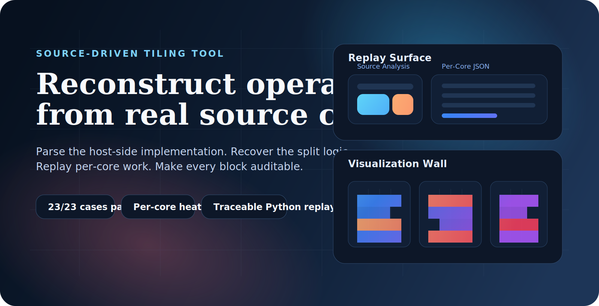
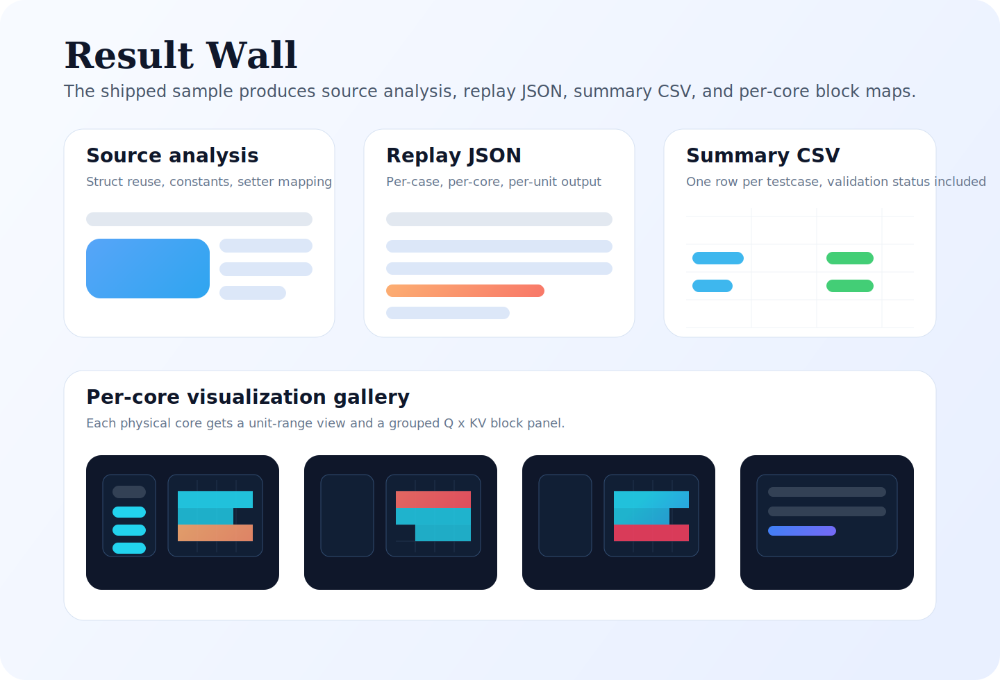
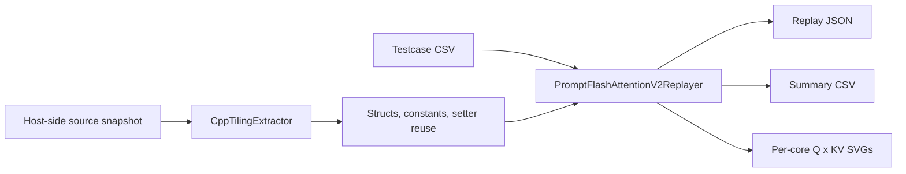

<p align="center">
  
</p>

<h1 align="center">Source-Driven Tiling Tool</h1>

<p align="center">
  从真实 host 侧源码重建算子 tiling，按物理 core 复刻执行结果，并让每个 block 都可审计。
</p>

<p align="center">
  <a href="README.md"><strong>English</strong></a> |
  <a href="README.zh-CN.md"><strong>简体中文</strong></a>
</p>

<p align="center">
  
</p>

## 项目速览

| 项目 | 当前内置样板 |
| --- | --- |
| 首个正式适配器 | `PromptFlashAttentionTilingV2` |
| API 与 testcase 路径 | `PFA V3` |
| 实际命中的 host 侧 tiling 实现 | `prompt_flash_attention_tiling_v2.cpp` |
| 默认输入 | 项目内 fixture 快照 + testcase 副本 |
| 输出格式 | JSON、CSV、SVG |
| 验证结果 | `23 / 23` 条 replay 用例通过，`6 / 6` 单元测试通过 |

`快速开始` | `架构` | `内置输入` | `输出` | `验证` | `路线图`

> 命名现实：
> 当前内置 testcase 和对外 API 是 `PFA V3`，但项目附带的 host 侧 tiling 实现文件是 `prompt_flash_attention_tiling_v2.cpp`。
> 因此，这个工具当前精确复刻的是 `PFA V3` 用例路径实际命中的 `V2` tiling 实现。

## 为什么做这个项目

算子 tiling 的问题往往贵在“难定位”。因为真实行为通常藏在三套叙事之间的缝隙里：

- API 名字看起来像什么
- testcase 实际覆盖了什么
- host 侧 tiling 实现到底往运行时结构里写了什么

这个项目就是为了解决这道缝。

它不是手工表格，也不是一次性脚本，而是一条从源码到可复刻 tiling 结果的可追溯流水线，并且保留了继续扩展到 matmul、together 等算子的骨架。

## 项目内已经包含什么

`source_driven_tiling_tool` 现在是一个可单独拿出去运行的 Python 项目，内置：

- 一份本地 testcase 副本
- 一份足以复现当前 FPA 样板的最小源码快照
- 可扩展到更多算子的 analyzer 架构
- 可追溯与可验证的交付文档，而不只是代码本身

当前第一优先级适配器是 Prompt Flash Attention 这一支。

## 快速开始

在项目根目录执行：

```bash
python tiling_tool.py analyze-source --output docs/fpa_source_analysis.json
python tiling_tool.py replay-cases --output examples/fa_tiling_output.json --summary-csv examples/fa_tiling_summary.csv --visualize-dir examples/visualizations
python -m unittest discover -s tests -v
```

如果你想显式指定输入，也可以这样跑：

```bash
python tiling_tool.py replay-cases --source-root fixtures/prompt_flash_attention --cases testcases/fa_testcases.csv --output examples/fa_tiling_output.json --summary-csv examples/fa_tiling_summary.csv --visualize-dir examples/visualizations
```

如果省略子命令、直接传 replay 参数，CLI 会默认走 `replay-cases`。

## 结果展示

<p align="center">
  
</p>

当前内置样板会产出：

- 源码分析报告
- 带逻辑 core / 物理 core 细节的 replay JSON
- testcase 汇总 CSV
- 每个物理 core 的 `Q x KV block` SVG 可视化

## 架构



更多细节见：[docs/architecture.md](docs/architecture.md)

## 内置输入

这个项目已经携带可直接运行的样板输入：

- testcase 副本：[testcases/fa_testcases.csv](testcases/fa_testcases.csv)
- 源码快照：
  - [fixtures/prompt_flash_attention/op_host/prompt_flash_attention_tiling.h](fixtures/prompt_flash_attention/op_host/prompt_flash_attention_tiling.h)
  - [fixtures/prompt_flash_attention/op_host/prompt_flash_attention_tiling_v2.cpp](fixtures/prompt_flash_attention/op_host/prompt_flash_attention_tiling_v2.cpp)
  - [fixtures/prompt_flash_attention/op_host/prompt_flash_attention_tiling_const.h](fixtures/prompt_flash_attention/op_host/prompt_flash_attention_tiling_const.h)
  - [fixtures/prompt_flash_attention/op_api/aclnn_prompt_flash_attention_v3.cpp](fixtures/prompt_flash_attention/op_api/aclnn_prompt_flash_attention_v3.cpp)

这份 fixture 快照是有意保持最小化的。它只保留了理解和复刻当前 FPA 路径所必需的文件，不是上游仓库的完整镜像。

## 输出

主产物如下：

- [examples/fa_tiling_output.json](examples/fa_tiling_output.json)
- [examples/fa_tiling_summary.csv](examples/fa_tiling_summary.csv)
- [examples/visualizations](examples/visualizations)

每条 case 的核心输出包括：

- `logical_core_assignments`：源码语义下的逻辑切分组
- `core_assignments`：展开后的物理 core 视图
- `task_units`：最细粒度的 replay 工作单元
- `task_segments`：连续工作段压缩结果
- `task_summary`：便于人工核对的摘要

每个物理 core 的 SVG 中：

- 左侧是 unit-index 覆盖条
- 右侧是按 `(batch, head)` 分组的 `Q x KV block` 面板

如果 `case_id` 重复，输出文件名会自动去重，不会覆盖前一个可视化。

## 仓库布局

```text
source_driven_tiling_tool/
|-- assets/
|   |-- brand/
|   `-- gallery/
|-- fixtures/
|   `-- prompt_flash_attention/
|-- testcases/
|   `-- fa_testcases.csv
|-- src/op_tiling_analyzer/
|   |-- analyzers/
|   |-- cli.py
|   |-- models.py
|   `-- utils.py
|-- tests/
|-- docs/
|-- examples/
|-- CONTRIBUTING.md
|-- pyproject.toml
|-- README.md
|-- README.zh-CN.md
`-- tiling_tool.py
```

## 当前范围

现在已经真实落地的是：

- 一个正式化 analyzer：`PromptFlashAttentionTilingV2`
- 一套已验证 testcase：`fa_testcases.csv`
- 一个重点验证 split 模式：`SPLIT_NBS_CUBE`
- 一种已交付可视化：按物理 core 展示 `Q x KV block` SVG

还没有做到的是：

- 还不是一个拥有多算子适配器的平台
- 还不能宣称覆盖上游源码树里的所有复杂分支
- 还没有内置 matmul 或 together 的 analyzer

## 验证

随项目一起交付的验证材料：

- 源码分析报告：[docs/fpa_source_analysis.json](docs/fpa_source_analysis.json)
- 可追溯文档：[docs/fpa_traceability.md](docs/fpa_traceability.md)
- 测试报告：[docs/test_report.md](docs/test_report.md)
- skill 构建报告：[docs/skill_build_report.md](docs/skill_build_report.md)

当前内置结果：

- `23 / 23` 条 replay 用例通过
- `23 / 23` 条用例满足 `coverage_ok=True`
- `23 / 23` 条用例满足 `weighted_coverage_ok=True`
- `6 / 6` 自动化测试通过
- 共输出 `23` 张 SVG，已验证重复 case 的后缀去重

## 贡献方式

下一步最有价值的贡献通常是：

1. 在 `src/op_tiling_analyzer/analyzers` 下新增新的算子 analyzer
2. 新增 testcase 集合与对应 replay 报告
3. 提升源码提取层的鲁棒性
4. 在不牺牲可审计性的前提下提升可视化密度

贡献说明见：[CONTRIBUTING.md](CONTRIBUTING.md)

## 路线图

- 在输出里显式区分 `API version` 与 `tiling implementation version`
- 增加第二个 analyzer，证明框架确实可复用
- 为大批量 testcase 增加概览级可视化
- 为更多布局与 sparse 模式补充 richer fixture packs
