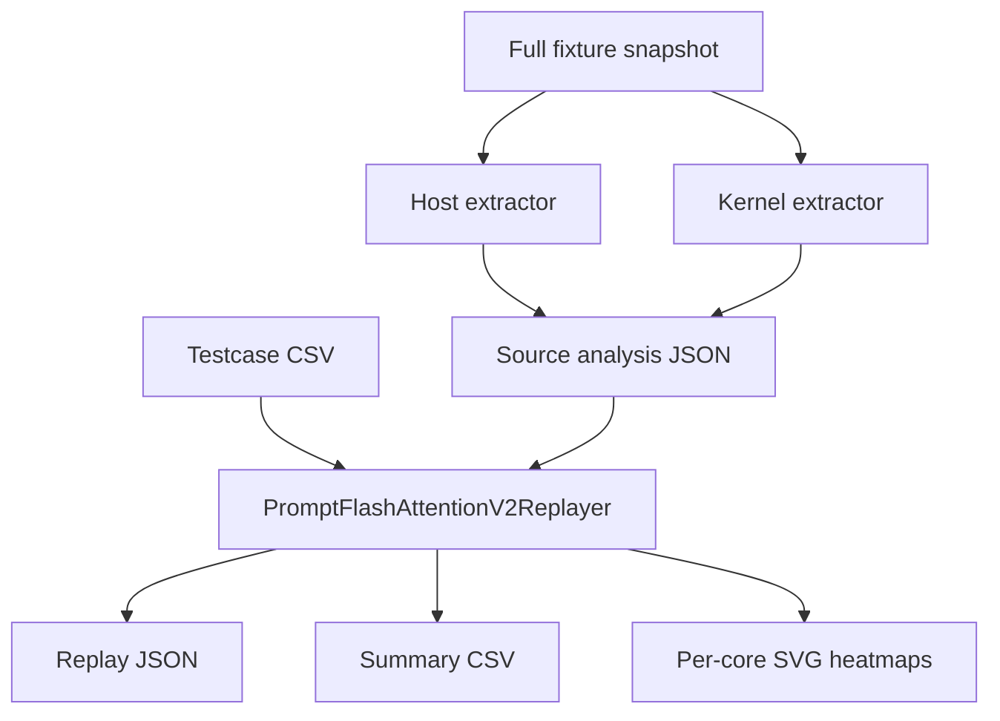

# Architecture

## Design Goal

Answer one question with source-backed detail:

What does each physical core execute, and which kernel-side dispatch family is likely consuming that tiling payload?

## Layers

### 1. Fixture snapshot

The shipped sample uses a complete fixture snapshot under [`fixtures/prompt_flash_attention`](../fixtures/prompt_flash_attention).

This matters because the analysis now needs both:

- `op_host` for tiling generation
- `op_kernel` for entry, dispatch, and lane-role context
- file-level manifest evidence so the shipped snapshot can be checked against the workspace source tree

### 2. Host-side source extraction

Implemented in [`src/flashattention_analyzers/cpp_tiling.py`](../src/flashattention_analyzers/cpp_tiling.py).

Responsibilities:

- extract tiling structs from `BEGIN_TILING_DATA_DEF(...)`
- extract compile-time constants
- recover `set_*` writer mappings
- locate source spans for key host functions
- report fixture manifest and workspace sync evidence alongside source analysis

### 3. Kernel-side source extraction

Implemented in [`src/flashattention_analyzers/kernel_source.py`](../src/flashattention_analyzers/kernel_source.py).

Responsibilities:

- identify kernel entrypoints in `op_kernel/prompt_flash_attention.cpp`
- identify dispatch branches in `op_kernel/prompt_flash_attention_arch32.h`
- surface tiling-key template traceability
- match replayed cases to kernel dispatch candidates

### 4. Operator replay

Implemented in [`src/flashattention_analyzers/fpa_v2.py`](../src/flashattention_analyzers/fpa_v2.py).

Responsibilities:

- parse testcase rows into structured inputs
- emit host-side tiling branch trace and condition results
- reproduce split-factor selection
- reproduce unit traversal order
- split logical core groups
- expand physical cores
- attach selected tiling key, dispatch candidates, and kernel execution context
- render per-core SVGs

### 5. CLI

Implemented in:

- [`cli.py`](../cli.py)
- [`tiling_tool.py`](../tiling_tool.py)
- [`src/flashattention_cli.py`](../src/flashattention_cli.py)

Responsibilities:

- expose a simple replay-first entry with `--input` and `--output-dir`
- expose `analyze-source`, `replay-cases`, and `visualize`
- default to the shipped fixture and testcase copy
- write JSON, CSV, and SVG outputs

## Data Flow

## Current Reality

- The testcase / public API path is `PFA V3`.
- The host tiling implementation being replayed is `prompt_flash_attention_tiling_v2.cpp`.
- The current workload path is `SPLIT_NBS_CUBE`, so one logical assignment expands into `vector` and `cube` physical lanes.

## Extension Strategy

1. Keep host extraction reusable.
2. Keep kernel extraction reusable.
3. Add operator-specific replay math in a dedicated analyzer.
4. Keep fixture completeness, testcase validation, docs, and examples in sync.
