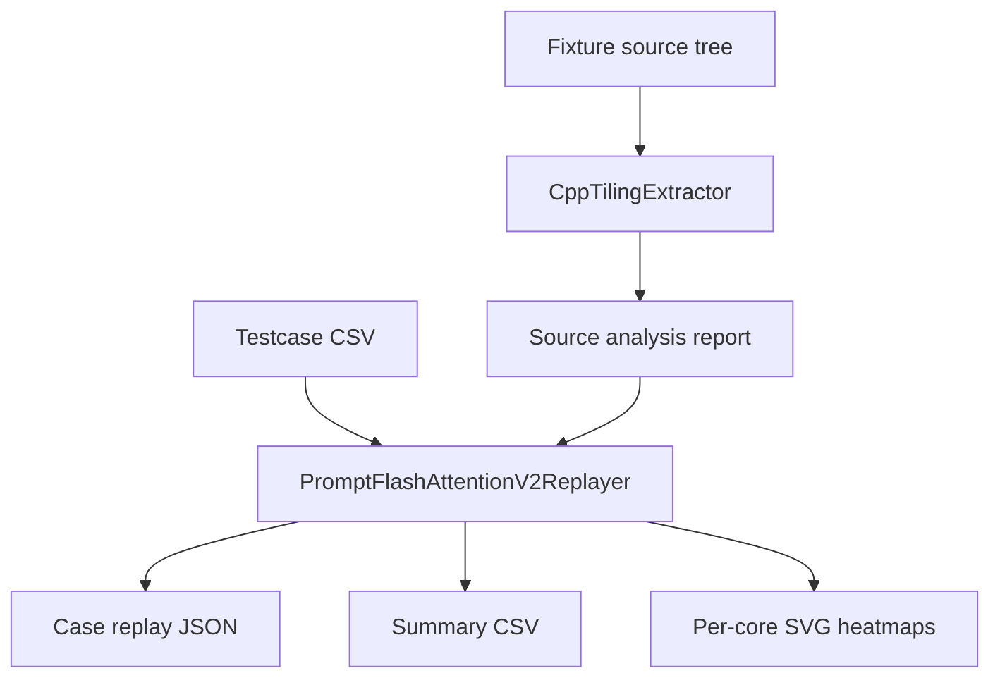

# Architecture

## Design Goal

Make the replay logic answer one question clearly:

What work does each physical core actually execute, according to the host-side tiling implementation in the source tree?

## Layers

### 1. Source extraction

Implemented in [src/op_tiling_analyzer/analyzers/cpp_tiling.py](../src/op_tiling_analyzer/analyzers/cpp_tiling.py).

Responsibilities:

- extract tiling structs from `BEGIN_TILING_DATA_DEF(...)`
- extract compile-time constants
- recover `set_*` writer mappings
- locate source spans for key functions

### 2. Operator replay

Implemented in [src/op_tiling_analyzer/analyzers/fpa_v2.py](../src/op_tiling_analyzer/analyzers/fpa_v2.py).

Responsibilities:

- parse testcase rows into structured inputs
- reproduce split factor selection
- reproduce unit traversal order
- split logical core groups
- expand physical cores
- generate per-core `task_units`, `task_segments`, and SVGs

### 3. CLI and packaging

Implemented in:

- [tiling_tool.py](../tiling_tool.py)
- [src/op_tiling_analyzer/cli.py](../src/op_tiling_analyzer/cli.py)

Responsibilities:

- expose `analyze-source`, `replay-cases`, and `visualize`
- make the shipped fixture and testcase the default sample path
- write JSON, CSV, and SVG outputs

## Data Flow

## Why the current adapter is called V2

The shipped testcase path uses the `PFA V3` API, but the provided host-side tiling implementation file is `prompt_flash_attention_tiling_v2.cpp`. The current adapter therefore models the `V2` tiling implementation that backs the shipped `V3` testcase path.

## Extension Strategy

To add a new operator:

1. keep `cpp_tiling.py` as the shared source-extraction layer
2. add a new analyzer file for operator-specific math and traversal rules
3. register it in the CLI
4. add fixture source, testcase set, tests, replay output, and docs
